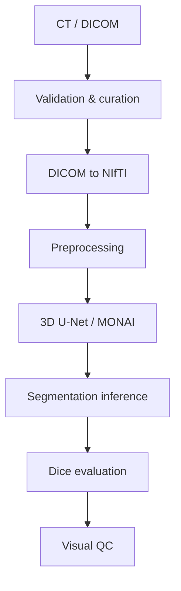

<!-- Independent portfolio project. Not affiliated with, endorsed by, or -->
<!-- produced in collaboration with DEPICT or Rigshospitalet. -->

# Medical Imaging Research Pipeline

This repository demonstrates a reproducible research workflow for
volumetric CT segmentation: medical image ingestion, curation, DICOM
de-identification, preprocessing, 3D segmentation with MONAI/PyTorch,
evaluation, and asynchronous execution behind a job queue. It is an
independent portfolio project; design choices were informed by publicly
available medical-imaging research code and dataset documentation, cited
throughout, but the implementation is original and untested against no
proprietary or restricted material.

## Pipeline



Training and inference run as asynchronous jobs behind a queue, so a
client submits work and polls for a result rather than blocking on a
long-running process:


## Real-data experiment

The real-data target is **3D-IRCADb-01** (IRCAD): 20 patient CT volumes
with liver segmentation masks (patient count per the wider literature on
this dataset, not independently re-verified against IRCAD's current
release), a standard liver-segmentation benchmark. DEPICT-RH's
Multimodal-HC dataset was investigated first (`docs/DEPICT_TECHNICAL_
RESEARCH.md`), but its full imaging data requires a Data User Agreement;
IRCAD needs only a free registration, so it was chosen instead. **No
Multimodal-HC data was used to train or evaluate any model in this
project.**

`medimg_pipeline data-import --dataset ircad` discovers each patient's CT
and liver-mask DICOM series, de-identifies both, converts them to NIfTI,
binarizes the mask, and validates that image and mask share the same
shape and affine, writing into the layout `medimg_pipeline curate`
expects. The full chain — import, curation with subject-level splitting,
MONAI preprocessing, 3D U-Net training with checkpointing and early
stopping, sliding-window inference, Dice evaluation, and visual QC — is
exercised end to end in this repository's automated tests, against
synthetic DICOM fixtures built to IRCAD's documented directory layout
(`PATIENT_DICOM` / `MASKS_DICOM/liver`).

**No training run on real 3D-IRCADb-01 data has been performed for this
repository.** The development environment this project was built in has
no network access to IRCAD's site or any other external dataset host, so
the dataset could not be downloaded here; this is a network restriction
of that environment, not a licensing or access limitation of the
dataset. Downloading it (a five-minute registration, no fee) and running

```bash
medimg_pipeline data-import --dataset ircad --input <path> --staging data/.staging/ircad --output data/ircad
medimg_pipeline curate --data-root data/ircad
medimg_pipeline train --config configs/train_small.yaml
```

on any machine with normal internet access is the only step remaining to
produce real Dice scores and QC figures; no metric is reported here that
was not actually measured, so none is shown for this dataset yet.

## Architecture

Python, PyTorch and MONAI for the model and training loop, pydicom and
nibabel for DICOM/NIfTI I/O, FastAPI with a Redis/RQ queue for
asynchronous execution, and Docker for deployment. Full dependency list
in `pyproject.toml`.

## Reproduce

```bash
git clone https://github.com/hassanisaq97-blip/medical-imaging-research-pipeline
cd medical-imaging-research-pipeline
make setup
make test-fast
bash examples/quickstart.sh   # synthetic end-to-end walkthrough
```

`make docker-up` starts the API, worker, and Redis; see `docs/` for the
IRCAD import workflow and DICOM de-identification details.

## Data and privacy

- 3D-IRCADb-01: free registration at IRCAD, no DUA (`docs/data_access.md`).
- Multimodal-HC: full imaging data requires a Data User Agreement via
  PublicNeuro; not used here.
- No dataset file, in any form, is committed to this repository or built
  into a Docker image (`.gitignore`); automated tests use only
  procedurally generated synthetic fixtures.
- The DICOM de-identification module removes identifying metadata and
  pseudonymizes linking identifiers, but does not detect burned-in pixel
  annotations and is not a certified anonymization tool
  (`docs/anonymization.md`).
- Research software: not a certified medical device, no clinical claims.

## References

- 3D-IRCADb-01, IRCAD: https://www.ircad.fr/research/data-sets/liver-segmentation-3d-ircadb-01/
- DEPICT-RH, Multimodal-HC: https://github.com/DEPICT-RH/Multimodal-HC
- Wasserthal et al., TotalSegmentator: https://github.com/wasserth/TotalSegmentator
- MONAI: https://monai.io
