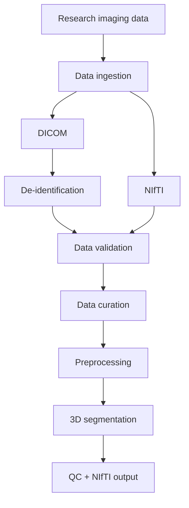
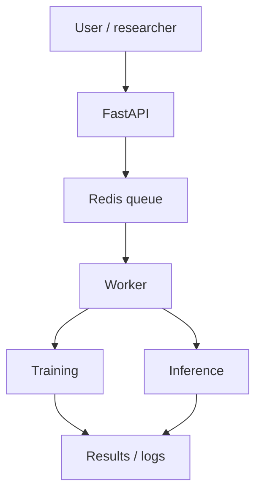

# medical-imaging-research-pipeline

Reproducible medical-imaging research infrastructure: DICOM
de-identification, data curation with QC, a MONAI/PyTorch 3D
segmentation pipeline, inference, visual QC, and a Redis/FastAPI job
queue -- built to resemble the technical infrastructure that supports an
AI medical-imaging research group.

> **This is an independent portfolio project inspired by publicly
> described workflows and open research resources from DEPICT,
> Rigshospitalet. It is not an official DEPICT or Rigshospitalet
> project.** It is not a certified medical device and makes no clinical
> claims; it is research/engineering software.

## 1. Project overview

This project implements a full, working (not merely sketched) pipeline
for 3D anatomical segmentation from CT, plus the surrounding
infrastructure a research group actually needs day to day:

- a **data curation pipeline** that discovers subjects, validates NIfTI
  geometry, computes foreground voxel counts, and produces a manifest +
  QC report with leak-free train/val/test splits;
- a **DICOM de-identification module** with an audit trail, demonstrated
  on synthetic DICOM fixtures;
- an optional **DICOM → NIfTI ingestion pathway**;
- **MONAI-based preprocessing**, a **3D U-Net**, and a **training loop**
  with checkpointing, early stopping, and local experiment tracking;
- an **inference pipeline** producing a NIfTI mask + metadata JSON, plus
  automatic **visual QC** (PNG overlays, no GUI required);
- a **FastAPI + Redis (RQ) job queue** with a worker process, mirroring
  how training/inference jobs get scheduled in a real research
  environment;
- **Docker**, a **Makefile**, and **GitHub Actions CI**.

## 2. Why this project exists

I'm applying for a Scientific Software Developer / Data Scientist / Data
Engineer role at DEPICT, Rigshospitalet. That role is described as
supporting AI researchers with image analysis and data processing, data
curation and anonymization, segmentation tooling, training/queuing
infrastructure, and debugging -- on Linux, with real deep learning and
real medical imaging. Rather than a generic Kaggle notebook or a
Streamlit demo, this project tries to look like the kind of
infrastructure that role actually involves, built end-to-end and tested
against synthetic data where real data access requires a Data User
Agreement (see §6).

## 3. Architecture

**Data pipeline:**



**Job-queue infrastructure:**



Package layout:

```
src/medimg_pipeline/
    anonymization/   DICOM metadata de-identification (pydicom)
    api/             FastAPI app: /jobs/*, /health
    curation/        manifest, QC, subject-level splits
    data/            manifest -> MONAI DataLoader
    imaging/         NIfTI I/O + validation, DICOM->NIfTI ingestion
    models/          3D U-Net (MONAI)
    preprocessing/   MONAI transform pipelines
    training/        config, training loop, local experiment tracking
    inference/       NIfTI in -> mask + metadata out
    queue/           Redis-backed job store + RQ worker
    qc/              visual QC (PNG overlays)
    utils/           logging, device selection, seeding, env config
    exceptions.py    domain-specific exceptions with actionable hints
```

## 4. Dataset

Primary dataset: DEPICT-RH's
[**Multimodal-HC**](https://github.com/DEPICT-RH/Multimodal-HC) -- a
multimodal total-body dynamic ¹⁸F-FDG PET/CT/MRI dataset of 100 healthy
adults. `docs/DEPICT_TECHNICAL_RESEARCH.md` documents exactly what was
observed in DEPICT-RH's public repositories (layout, naming conventions,
segmentation derivatives, dependencies) before any code here was
written, and what this project builds independently on top of that. This
project does not claim authorship of, or affiliation with, that dataset.

## 5. Ethical / privacy considerations

- No raw medical images, DICOM files, or model checkpoints are committed
  to this repository (`.gitignore`).
- No protected health information appears in logs, filenames, experiment
  tracking, or the curation manifest -- only pseudonymous subject IDs,
  file paths, and aggregate statistics.
- The DICOM de-identification module is described precisely as
  **de-identification**, not "guaranteed anonymization" -- see
  `docs/anonymization.md` for why that distinction matters and what it
  does not cover (burned-in pixel annotations, in particular).
- This is research software: it makes no clinical claims and is not a
  certified medical device.

## 6. Data access

See `docs/data_access.md` for the full walkthrough. Summary: precomputed
readouts are freely explorable; full PET/CT/MRI imaging requires signing
a Data User Agreement via PublicNeuro (manual, identity-verified, not
automatable). Run:

```bash
python -m medimg_pipeline data-check
```

This prints exactly what to do if data is not yet available, or a ready
summary if it is. Everything else in this project runs end-to-end right
now on synthetic fixtures, with no code changes needed once real data is
available (`bash examples/quickstart.sh`).

## 7. Data curation

`medimg_pipeline curate` discovers subjects via a configurable glob
pattern, opens every image/mask pair, and validates shape, affine,
voxel spacing, and foreground voxel count, producing:

- `data_manifest.csv` -- one row per subject: pseudonymous ID, image/mask
  paths, shape, voxel spacing, foreground voxel count, QC status/message,
  split.
- a QC report (JSON) that separately lists every **excluded** subject and
  the reason (missing modality, missing mask, empty mask, shape/affine
  mismatch, below-threshold foreground voxels) -- nothing is silently
  dropped.

Splitting is subject-level and deterministic (seeded hash of subject ID,
not `random.shuffle`), so re-running curation never reshuffles an
existing subject into a different split, and a subject can never appear
in more than one split.

```bash
medimg_pipeline curate --data-root "$DATASET_ROOT" \
    --min-foreground-voxels 500 \
    --output-manifest outputs/curation/data_manifest.csv \
    --output-qc-report outputs/curation/qc_report.json
```

## 8. Anonymization / de-identification

`medimg_pipeline anonymize` recursively de-identifies a directory of
DICOM files using `pydicom`: removes direct identifiers and free-text
fields, strips private tags, and replaces `PatientID`/`AccessionNumber`/
the UID triplet with deterministic pseudonyms derived from a secret salt
-- while preserving every tag needed for correct scientific image
processing (geometry, pixel data encoding, acquisition parameters). It
writes to a separate staging directory (never overwriting the input) and
produces an audit report listing tag names and actions taken, **never**
original values.

```bash
export MEDIMG_ANON_SALT="$(openssl rand -hex 16)"   # keep this secret
medimg_pipeline anonymize --input ./raw_dicom --output ./deidentified_dicom
```

See `docs/anonymization.md` for the anonymization-vs-pseudonymization-vs
-de-identification distinction and its limits (burned-in pixel
annotations are **not** covered). Tested against synthetic DICOM fixtures
with obviously fake identifiers (`tests/test_anonymization.py`) -- the
Multimodal-HC data itself is already prepared for research release by
DEPICT-RH and was never processed by this module; see `docs/anonymization.md`.

An optional DICOM → NIfTI ingestion pathway chains de-identification →
validation → conversion → QC:

```bash
medimg_pipeline ingest --input ./raw_dicom --staging ./staging --output ./nifti_out
```

using the pure-Python `dicom2nifti` backend by default, or `dcm2niix` if
requested and installed (a clear `MissingExternalToolError` with install
instructions is raised otherwise -- never a confusing subprocess crash).

## 9. Medical image preprocessing

MONAI transform pipelines (`medimg_pipeline.preprocessing.transforms`)
handle orientation normalization, resampling to isotropic spacing,
CT intensity windowing/normalization, foreground-aware patch cropping,
and augmentation -- **training-only**; the eval/inference pipeline is
deterministic. **Segmentation masks are always resampled with
nearest-neighbour interpolation**, never bilinear/spline, matching the
convention observed directly in Multimodal-HC's own derivative-resampling
scripts (`docs/DEPICT_TECHNICAL_RESEARCH.md` §1.4) -- any other
interpolation mode invents fractional class labels that never existed.

## 10. Segmentation model

Target: **liver segmentation from low-dose CT**. Chosen deliberately, not
arbitrarily -- see `docs/segmentation_target_selection.md` for the full
reasoning (large contiguous organ → favorable foreground/background
ratio for patch training; stable anatomy; the standard PET SUV reference
organ, so it has a plausible use beyond this demo). A small, laptop-sized
3D U-Net (MONAI `UNet`, 4-5 levels, 16-256 channels) is the default;
`configs/train_gpu.yaml` widens it for a real GPU run.

## 11. Training

```bash
medimg_pipeline train --config configs/train_small.yaml
```

- Automatic device selection: **CUDA → MPS → CPU** (never silently
  fails -- `medimg_pipeline.utils.device.resolve_device`).
- Mixed precision on CUDA only (MPS autocast support is partial/version
  dependent, so it's disabled there rather than risking silently wrong
  results).
- Dice+CrossEntropy loss, Dice metric, checkpointing of the best model by
  validation Dice, early stopping, reproducible seeding.
- Validation runs full-size volumes through `sliding_window_inference`
  (not a direct forward pass) -- this matters, because a validation
  volume's resampled size is not guaranteed to be divisible by the
  U-Net's total downsampling stride, and a direct forward pass can crash
  with a tensor-size mismatch at a skip connection. This was caught and
  fixed by actually running the pipeline end-to-end, not just unit
  testing components in isolation.
- A CUDA/MPS out-of-memory error is caught and re-raised as
  `OutOfMemoryError` with a concrete recommendation (reduce
  `--batch-size`/`patch_size`), not a raw crash.
- Local experiment tracking (`medimg_pipeline.training.tracking`) writes
  JSON + CSV per experiment: git commit, config, dataset manifest hash,
  per-epoch train/val loss, Dice, runtime, device. No external service,
  nothing leaves the local filesystem.

`configs/train_small.yaml` is CPU/MPS-friendly (64³ patches, a narrow
U-Net); `configs/train_gpu.yaml` is a full-size configuration for a real
CUDA GPU.

## 12. Inference

```bash
medimg_pipeline infer --input image.nii.gz --checkpoint models/best.pt \
    --output outputs/ --qc
```

Runs the same deterministic preprocessing as validation, predicts with
`sliding_window_inference`, then resamples the prediction back onto the
**original** image's grid (nearest-neighbour) before saving -- so the
output mask overlays correctly on the un-preprocessed input in any
viewer. Writes `<name>_seg.nii.gz`, `<name>_metadata.json` (device,
runtime, foreground voxel count, an explicit research-use disclaimer),
and (with `--qc`) a PNG overlay via automatic visual QC.

## 13. Visual QC

`medimg_pipeline.qc.visual.generate_overlay_figure` selects representative
slices that actually contain the predicted organ, overlays the mask (and
optional ground truth, outlined) on the image, and saves a PNG -- using
Matplotlib's `Agg` backend explicitly, so it works headless in CI/Docker
with no display.

## 14. Job queue

```
FastAPI  ->  Redis-backed queue (RQ)  ->  worker  ->  training/inference job
```

- `POST /jobs/inference`, `POST /jobs/training` -- enqueue a job, return
  a job ID.
- `GET /jobs/{id}` -- status (`QUEUED`/`RUNNING`/`COMPLETED`/`FAILED`),
  timestamps, output path, sanitized error.
- `GET /jobs/{id}/logs` -- log lines captured from the worker for that
  job.
- `GET /health` -- liveness + Redis connectivity.

Job metadata and logs live in Redis (`medimg_pipeline.queue.jobs`); RQ is
used only to dispatch execution to a worker process. Nothing
patient-identifying is ever stored in job parameters, logs, or errors.

```bash
make docker-up          # api + worker + redis
curl -s localhost:8000/health
```

## 15. Error handling

Every layer raises a specific `MedImgError` subclass
(`medimg_pipeline.exceptions`) with a short message and, where useful, an
actionable `hint` -- covering a missing image, a corrupt NIfTI, a
shape/affine mismatch, an empty mask, a missing modality/checkpoint, an
unavailable requested device, a GPU/MPS out-of-memory condition, a
missing external tool (`dcm2niix`), a DICOM conversion failure, an
unreachable Redis, and a failed worker job. The CLI (`__main__.py`)
catches this hierarchy at the top level and prints the message + hint
instead of a raw traceback; unexpected errors still show a full
traceback (clearly logged as unexpected), so real bugs are never hidden.
Structured logs (`medimg_pipeline.utils.logging`) always carry a
timestamp, component, severity, and job ID, and never a patient
identifier.

## 16. Docker / Linux

```bash
make docker-up      # builds + starts api, worker, redis (docker compose)
make docker-down
```

CPU-only by default and runnable without a GPU (see `docker-compose.yml`
for the commented-out NVIDIA Container Toolkit block for a real GPU
worker). No macOS-only paths anywhere; every path is either relative or
comes from `.env`/CLI flags (`.env.example` documents every variable).
Standard `Makefile` targets: `setup`, `test`, `lint`, `curate`,
`train-small`, `train-gpu`, `api`, `worker`, `docker-up`, `docker-down`,
`data-check`, `quickstart`.

> **Note on this development environment:** this project's Docker/Compose
> configuration was validated for syntax (`docker compose config`) and
> the Dockerfile was reviewed by inspection; an actual `docker build` could
> not be executed in the sandboxed session this was built in, because its
> network policy blocks the Docker Hub registry CDN. Run `make docker-up`
> on your own machine to build the images for real.

## 17. Tests

```bash
pytest tests/ -v              # everything
pytest tests/ -v -m "not slow"   # fast unit tests only (no training)
pytest tests/ -v -m "slow"        # the end-to-end smoke test only
```

Nothing depends on real Multimodal-HC data: NIfTI images/masks and DICOM
series are generated procedurally (`tests/helpers.py`), including fake
"identifying" DICOM fields used specifically to verify the anonymization
module removes them. Coverage: NIfTI loading/validation, curation
(manifest, QC, leak-free/stable splits), DICOM de-identification (fake
PHI removal, UID validity, private-tag stripping, audit-report safety),
DICOM→NIfTI ingestion, U-Net forward pass, a full
curate→train→infer→QC smoke test, the Redis job store (including a real
`rq.Worker` in burst mode), and the FastAPI endpoints. GitHub Actions CI
(`.github/workflows/ci.yml`) runs a Redis service container, lint, the
fast suite, and the tiny smoke test on every push -- it does not train a
real model.

## 18. Example results

`examples/quickstart.sh` reproduces a full curate → train (2 epochs,
CPU) → infer → QC run on synthetic data and leaves its outputs under
`examples/_quickstart_output/` for inspection. **Every number this
produces is a synthetic smoke-test result, not a claim about real
segmentation performance** -- no model has been trained on real
Multimodal-HC data in this environment (see §6), and nothing in this
repository states or implies otherwise.

## 19. Limitations

- No model has been trained on real Multimodal-HC data -- full imaging
  access requires a Data User Agreement not yet completed in this
  environment (§6).
- The liver-segmentation label index used against a real Multimodal-HC
  checkout (`docs/segmentation_target_selection.md`) is based on
  TotalSegmentator's publicly documented class map, not verified against
  an actual derivative file; verify it before relying on real results.
- DICOM de-identification covers metadata only -- burned-in pixel
  annotations are not detected or removed (`docs/anonymization.md`).
- `dcm2niix` support is implemented but not exercised in CI (only the
  pure-Python `dicom2nifti` backend is tested there).
- The job queue assumes a single worker process per job (no distributed
  locking/idempotency handling for a worker crashing mid-job).
- Docker images were not build-verified in this development environment
  (network policy restriction, §16).

## 20. Future work

- Extend the curated label set to kidneys (multi-instance) once the
  liver pipeline is validated against real data -- the manifest already
  records per-label foreground voxel counts for every TotalSegmentator
  label, not just the liver.
- Wire up `dcm2niix`-backend CI coverage (would need the binary in the
  CI image).
- Add MLflow as an optional local tracking backend alongside the current
  JSON/CSV tracker.
- Add a lightweight PACS/DICOMweb ingestion source in addition to a flat
  DICOM directory.

## 21. Reproducibility

- Deterministic seeding across Python/NumPy/PyTorch
  (`medimg_pipeline.utils.seed.set_seed`).
- Deterministic, hash-based train/val/test splitting that is stable
  across reruns and never leaks a subject across splits (§7).
- Every experiment run records its git commit, config, and dataset
  manifest hash (§11).
- No absolute paths anywhere; all configuration goes through `.env` /
  CLI flags / YAML configs.

```bash
make setup
make data-check
make quickstart      # or: bash examples/quickstart.sh
make test-fast
make docker-up
```

## 22. Acknowledgements

- **DEPICT-RH**, Rigshospitalet, for the publicly described **Multimodal-HC**
  dataset and repositories used as technical reference (see
  `docs/DEPICT_TECHNICAL_RESEARCH.md`). This project is not affiliated
  with DEPICT-RH and makes no claim of authorship over their dataset,
  code, or research.
- **TotalSegmentator** (Wasserthal et al.) and **SynthSeg**, used by
  DEPICT-RH to produce the segmentation derivatives this project's
  curation pipeline is designed to consume.
- **MONAI**, used throughout for medical-imaging-specific transforms,
  losses, metrics, and network building blocks.

## 23. References

- DEPICT-RH, *Multimodal-HC*: https://github.com/DEPICT-RH/Multimodal-HC
- DEPICT-RH, *CTlessPET*: https://github.com/DEPICT-RH/CTlessPET
- DEPICT-RH, *bat-seg* (TotalSegmentator + BAT task): https://github.com/DEPICT-RH/bat-seg
- DEPICT-RH, *postoperative brain tumor segmentation with BraTS*: https://github.com/DEPICT-RH/postoperative_brain_tumor_segmentation_with_brats
- Wasserthal et al., *TotalSegmentator*: https://github.com/wasserth/TotalSegmentator
- MONAI: https://monai.io
- PublicNeuro data catalog: https://datacatalog.publicneuro.eu/dataset/super/V2

---

## Repository layout

```
medical-imaging-research-pipeline/
├── src/medimg_pipeline/   application code (see §3)
├── tests/                 pytest suite + synthetic-data helpers
├── scripts/setup_data.py  Multimodal-HC access automation (§6)
├── configs/               YAML training configs
├── docs/                  DEPICT research notes, data access, anonymization, target selection
├── examples/              quickstart.sh (synthetic end-to-end walkthrough)
├── Dockerfile, docker-compose.yml, Makefile
└── .github/workflows/ci.yml
```
